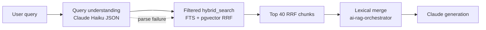

# Retrieval architecture

Yamalé Legal Platform RAG uses **law-level lexical search** plus an optional **chunk-level hybrid retrieval** pipeline (FTS + pgvector + RRF). The chat API contract is unchanged; improvements are behind env flags.

## Pipeline diagram



## Data model

Chunks live in **`law_embeddings`** (not a separate `chunks` table):

| Column | Purpose |
|--------|---------|
| `chunk_text` | Chunk body (breadcrumb prepended before embedding) |
| `breadcrumb` | `{Country} > {Law title} > {Chapter} > {Article N}` |
| `jurisdiction` | ISO2 or `OHADA` |
| `domain` | Legal category / domain |
| `article_ref` | Article heading reference |
| `language` | Corpus language (`en`, `fr`, `pt`, `ar`) |
| `fts` | Generated `tsvector` over breadcrumb + text (`simple` config) |
| `embedding` | pgvector cosine index |

Progress for structured re-chunking: **`retrieval_backfill_progress`**.

Query diagnostics: **`ai_query_log.retrieval_metadata`** (jsonb).

## SQL migration

Apply in Supabase SQL editor:

```
docs/sql/law-embeddings-hybrid-retrieval-safe.sql
```

Run **each block separately** (the dashboard drops long HTTP requests). For large `law_embeddings` tables, do **not** use the generated `fts` column in `law-embeddings-hybrid-retrieval.sql` — use the safe file: plain `fts` + trigger + `npm run embeddings:backfill-fts`, then create GIN indexes.

Defines `hybrid_search(query_text, query_embedding, match_count, filter_jurisdictions, filter_domain, filter_model)` with RRF **k=60**, each leg fetching **3× match_count**. Reversible via the `DOWN` section in the same file.

## Environment variables

| Variable | Default | Description |
|----------|---------|-------------|
| `RETRIEVAL_MODE` | `vector` | `hybrid` enables FTS+vector RRF path; `vector` keeps legacy `match_law_embedding_chunks` |
| `RETRIEVAL_TOP_CHUNKS` | `40` | RRF-ranked chunks used for generation (max 100) |
| `AI_QUERY_UNDERSTANDING_ENABLED` | `1` | Set `0` to skip Haiku JSON step |
| `AI_QUERY_UNDERSTANDING_MODEL` | `claude-haiku-4-5-20251001` | Query understanding model |
| `AI_EMBEDDINGS_ENABLED` | `1` | Master switch for vector/hybrid passes |

## Code layout

| Path | Role |
|------|------|
| `lib/retrieval/query-understanding.ts` | Haiku JSON → jurisdiction filters, rewritten query |
| `lib/retrieval/jurisdiction-codes.ts` | ISO2 map; OHADA member → `[ISO, OHADA]` |
| `lib/retrieval/hybrid-search.ts` | RPC wrapper for `hybrid_search` |
| `lib/retrieval/hybrid-chunk-types.ts` | Chunk hit types + `RETRIEVAL_TOP_CHUNKS` |
| `lib/retrieval/pipeline.ts` | End-to-end chunk retrieval |
| `lib/retrieval/retrieval-mode.ts` | `RETRIEVAL_MODE` parsing |
| `lib/embeddings/structured-chunking.ts` | Article-boundary chunking + breadcrumbs |
| `lib/ai-rag-orchestrator.ts` | Lexical + hybrid merge (unchanged contract) |

## Chunking rules

1. Parse Markdown heading hierarchy; chunk on article/section boundaries.
2. Target **300–800 tokens** (~1200–3200 chars); split articles only above **~1000 tokens** with **15% overlap**.
3. Prepend breadcrumb before embedding.
4. Store metadata columns on `law_embeddings`.

## Backfill

Resumable one-law-at-a-time re-chunk + re-embed:

```bash
node --env-file=.env --import tsx scripts/backfill-structured-chunks.mjs --dry-run
node --env-file=.env --import tsx scripts/backfill-structured-chunks.mjs --resume
node --env-file=.env --import tsx scripts/backfill-structured-chunks.mjs --law-id <uuid>
```

## Evaluation

Golden set: `eval/golden_set.jsonl` — replace `REPLACE_WITH_LAW_UUID` with real law IDs from your corpus.

```bash
npm run eval:retrieval
npm run eval:retrieval -- --modes hybrid,vector --golden eval/golden_set.jsonl
```

Reports: `data/eval/runs/retrieval-eval-<timestamp>.md` with recall@5, recall@10, MRR overall and by language/jurisdiction.

## Rollback

1. Set `RETRIEVAL_MODE=vector` (immediate).
2. Run SQL `DOWN` section in `law-embeddings-hybrid-retrieval.sql` if removing DB objects.
