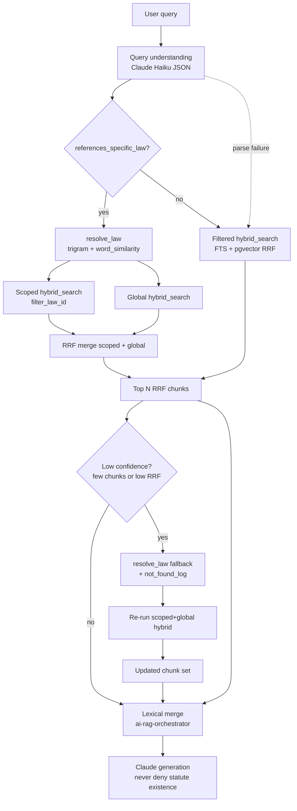

# Retrieval architecture

Yamalé Legal Platform RAG uses **law-level lexical search** plus an optional **chunk-level hybrid retrieval** pipeline (FTS + pgvector + RRF), with **law-title resolution** for spelling/plural/synonym variants. The chat API contract is unchanged; improvements are behind env flags.

## Pipeline diagram



Stages in order:

1. **Query understanding** — jurisdiction filters, rewritten query, `references_specific_law`, `law_name_mentioned`.
2. **Law resolver** — when a specific law is referenced, `resolve_law(query, jurisdiction)` returns top titles by trigram similarity; if combined score ≥ `RETRIEVAL_LAW_RESOLVE_THRESHOLD` (default 0.4), chunk search is scoped to that `law_id` **and** an unscoped pass is RRF-merged so retrieval never over-narrows.
3. **Hybrid search** — FTS (normalized + de-spaced text, per-row language config, synonym expansion) + pgvector RRF.
4. **Absence guard** — if confidence is low (< `RETRIEVAL_MIN_CHUNKS` or top RRF < `RETRIEVAL_MIN_TOP_RRF`), run jurisdiction-wide `resolve_law`, log to `retrieval_not_found_log`, optionally re-scope hybrid search.
5. **Generation** — system prompt forbids claiming a statute does not exist in a country; if corpus returns nothing, say the platform did not retrieve it and recommend official sources.

## Data model

Chunks live in **`law_embeddings`** (not a separate `chunks` table):

| Column | Purpose |
|--------|---------|
| `chunk_text` | Chunk body (breadcrumb prepended before embedding) |
| `breadcrumb` | `{Country} > {Law title} > {Chapter} > {Article N}` |
| `jurisdiction` | ISO2 or `OHADA` |
| `domain` | Legal category / domain |
| `article_ref` | Article heading reference |
| `language` | Corpus language (`en`, `fr`, `pt`, `ar`) |
| `fts` | `tsvector` over normalized breadcrumb + text + de-spaced variant; config from `language` |
| `embedding` | pgvector cosine index |

Laws table additions:

| Column / object | Purpose |
|-----------------|---------|
| `laws.normalized_title` | `normalize_legal_text(title)` for trigram matching |
| `legal_synonyms` | `(term, expansion, language)` — OR expansions into FTS `tsquery` |
| `retrieval_not_found_log` | Absence-guard fallback events for admin review |

Progress for structured re-chunking: **`retrieval_backfill_progress`**.

Query diagnostics: **`ai_query_log.retrieval_metadata`** (jsonb) — includes `law_resolver`, `scoped_law_id`, `confidence`, `absence_guard_fired`.

## SQL migrations

Apply in Supabase SQL editor **block by block** (dashboard drops long HTTP requests):

| File | Purpose |
|------|---------|
| `docs/sql/law-embeddings-hybrid-retrieval-safe.sql` | Initial `fts` column + trigger + `hybrid_search` v1 |
| `docs/sql/law-title-resolution-retrieval.sql` | Normalization, synonym table, `resolve_law`, `hybrid_search` v2, `not_found_log` |

For large `law_embeddings` tables, prefer the **safe** FTS path (plain column + trigger + `npm run embeddings:backfill-fts`) over a generated column.

After title-resolution SQL:

```bash
npm run laws:backfill-normalized-title
npm run embeddings:backfill-fts   # re-index with new fts formula if trigger updated
```

Create GIN indexes **concurrently** (one statement each, outside a transaction):

```sql
CREATE INDEX CONCURRENTLY IF NOT EXISTS law_embeddings_fts_gin_idx ON public.law_embeddings USING gin (fts);
CREATE INDEX CONCURRENTLY IF NOT EXISTS laws_normalized_title_trgm_idx ON public.laws USING gin (normalized_title gin_trgm_ops);
```

Reversible via the `DOWN` sections in each SQL file.

## Environment variables

| Variable | Default | Description |
|----------|---------|-------------|
| `RETRIEVAL_MODE` | `vector` | `hybrid` enables FTS+vector RRF path; `vector` keeps legacy `match_law_embedding_chunks` |
| `RETRIEVAL_TOP_CHUNKS` | `40` | RRF-ranked chunks used for generation (max 100) |
| `AI_QUERY_UNDERSTANDING_ENABLED` | `1` | Set `0` to skip Haiku JSON step |
| `AI_QUERY_UNDERSTANDING_MODEL` | `claude-haiku-4-5-20251001` | Query understanding model |
| `AI_EMBEDDINGS_ENABLED` | `1` | Master switch for vector/hybrid passes |
| `RETRIEVAL_LAW_RESOLVE_THRESHOLD` | `0.4` | Min `resolve_law` combined score to scope chunk retrieval |
| `RETRIEVAL_MIN_CHUNKS` | `3` | Absence guard: minimum chunk count for high confidence |
| `RETRIEVAL_MIN_TOP_RRF` | `0.012` | Absence guard: minimum top RRF score |
| `RETRIEVAL_ABSENCE_GUARD_ENABLED` | `1` | Set `0` to skip absence-guard fallback |
| `DATABASE_URL` | — | Direct Postgres URI for backfill scripts |

## Code layout

| Path | Role |
|------|------|
| `lib/retrieval/query-understanding.ts` | Haiku JSON → jurisdiction filters, law name fields |
| `lib/retrieval/law-resolver.ts` | RPC wrapper for `resolve_law` |
| `lib/retrieval/merge-chunk-hits.ts` | RRF merge for scoped + global hybrid passes |
| `lib/retrieval/absence-guard.ts` | Low-confidence detection + `retrieval_not_found_log` |
| `lib/retrieval/jurisdiction-codes.ts` | ISO2 map; OHADA member → `[ISO, OHADA]` |
| `lib/retrieval/hybrid-search.ts` | RPC wrapper for `hybrid_search` |
| `lib/retrieval/hybrid-chunk-types.ts` | Chunk hit types + `RETRIEVAL_TOP_CHUNKS` |
| `lib/retrieval/pipeline.ts` | End-to-end chunk retrieval |
| `lib/retrieval/retrieval-mode.ts` | `RETRIEVAL_MODE` parsing |
| `lib/embeddings/structured-chunking.ts` | Article-boundary chunking + breadcrumbs |
| `lib/ai-rag-orchestrator.ts` | Lexical + hybrid merge (unchanged contract) |
| `lib/ai-system-prompt.ts` | Generation rules (no false statute-denial) |
| `app/api/admin/legal-synonyms/` | Admin CRUD for `legal_synonyms` |
| `app/api/admin/retrieval-not-found/` | Admin list for `retrieval_not_found_log` |

## Chunking rules

1. Parse Markdown heading hierarchy; chunk on article/section boundaries.
2. Target **300–800 tokens** (~1200–3200 chars); split articles only above **~1000 tokens** with **15% overlap**.
3. Prepend breadcrumb before embedding.
4. Store metadata columns on `law_embeddings`.

## Backfill

Resumable one-law-at-a-time re-chunk + re-embed:

```bash
node --env-file=.env --import tsx scripts/backfill-structured-chunks.mjs --dry-run
node --env-file=.env --import tsx scripts/backfill-structured-chunks.mjs --resume
node --env-file=.env --import tsx scripts/backfill-structured-chunks.mjs --law-id <uuid>
```

FTS and normalized titles:

```bash
npm run embeddings:backfill-fts
npm run laws:backfill-normalized-title
```

## Evaluation

Golden set: `eval/golden_set.jsonl` — replace `REPLACE_WITH_LAW_UUID` with real law IDs from your corpus. Rows with `eval_kind: title_resolution` exercise the law-title resolver path (Zambia trademark variants, Kenya companies act, Senegal labour code).

```bash
npm run eval:retrieval
npm run eval:retrieval -- --modes hybrid --golden eval/golden_set.jsonl
```

Reports: `data/eval/runs/retrieval-eval-<timestamp>.md` with recall@5, recall@10, MRR overall and by language/jurisdiction, plus resolver hit rate for title-resolution rows.

## Rollback

1. Set `RETRIEVAL_MODE=vector` (immediate).
2. Set `RETRIEVAL_ABSENCE_GUARD_ENABLED=0` to disable fallback logging.
3. Run SQL `DOWN` sections in the migration files if removing DB objects.
